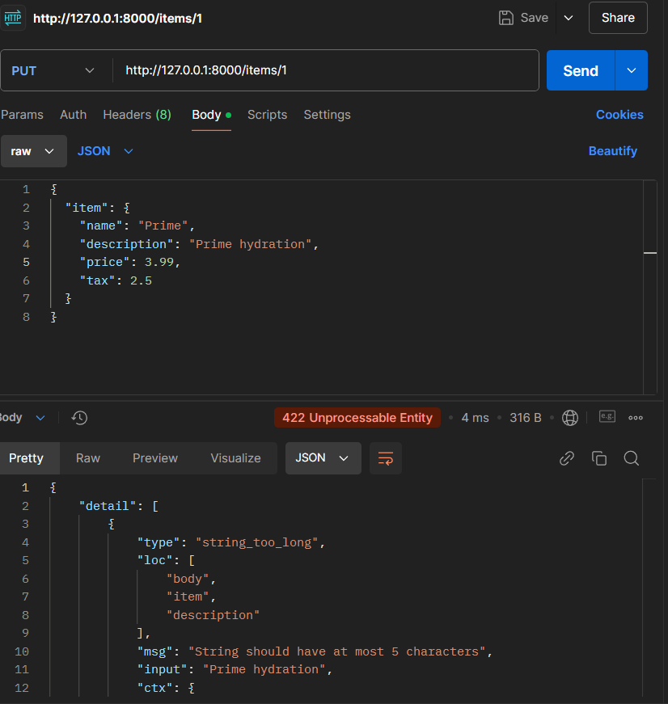

# UF2_FASTAPI

## Body - Fields POSTMAN

Fields és una opció diferent de declarar validacions i metadata. En aquest cas es fa mitjançant pydantic, important Fileds d'aquesta. 
On també es podria fer amb query, path i body que estan importats de fastapi. En aquest exemple s'afegeixen atributs com la longitud de text, descripció, títol i gt(major que).

En aquest exemple és pot veure un error el cual diu que la longitud del text a de contenir màxim 5 caràcters això perque he cambiat la longitud del text de 300 a 5 per poder veure que funcionen els valors dels atributs i així que surti l'error.

De la mateixa manera en aquest exemple també surt un error pero en aquest cas diu que l'input hauria de ser més gran que 1, això pasa perque a l'atribut gt(major que) he cambiat el valor de 0 a 1 per poder probar i veure el que passaba(l'error).

## Body - Nested Models SWAGGER

Als Nested Models cada atribut del model Pydantic té un "type", però aquest propi "type" pot ser un model de Pydantic. Com a exemple que he posat en el codi on declarem una imatge, l'hi afegim un "type", en aquest cas un string. A part de poder utilitzar els "types" més comuns que poden ser string, int, float... en Nested Models es poden utilitzar "types" més complexes apart de llistes diccionaris o sets(que permeten emmagatzemar elements i desprès accedir-hi d'una forma similar a les llistes.) que en aquest exemple el faig utilitzar per poder veure els tipus dels sucs.