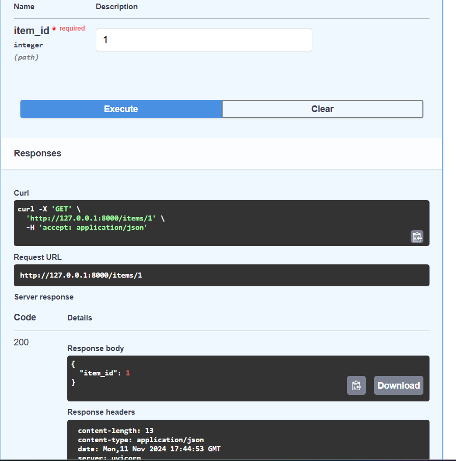
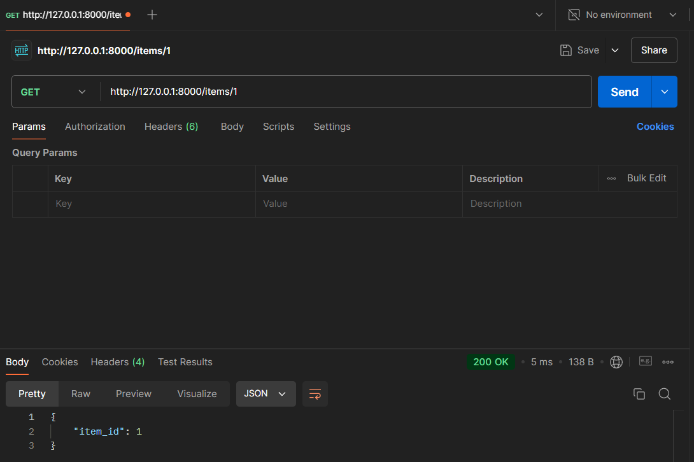
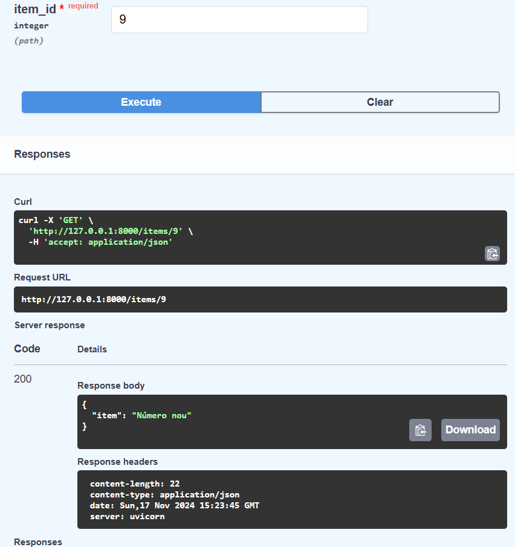
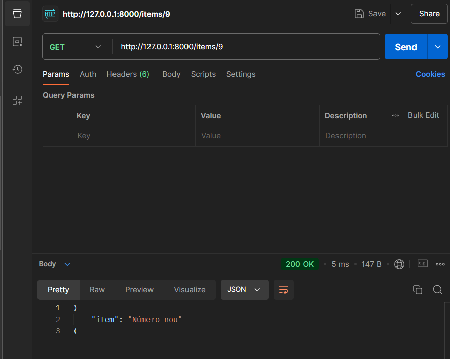
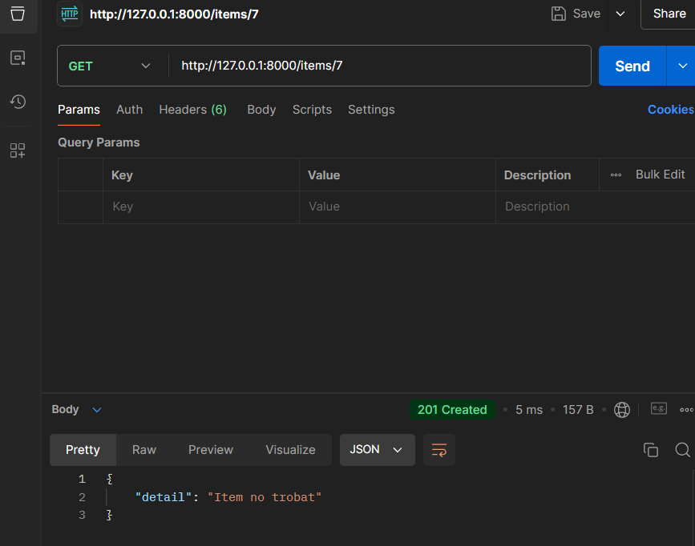

# UF2_FASTAPI

## Funció GET SWAGGER

El resultat ens mostra que l'item id es 1 que es el que hem escrit a description, com hem declarat que item_id sigui un int al rebre-ho ens ho retorna igual.

## Funció GET POSTMAN

Igual ens pasa a Postman, com a la url al final posem un número, l'item_id al ser int ens retorna el que rep.

## Funció POST SWAGGER

El resultat a Post amb el model de dades sortiría l'informació proporcionada al request body i al deixar la "descripció" com a opcional i no posar cap valor, al response body surt com a null.

## Funció POST POSTMAN

A Postman es pot veure el matexi resultat.

## Funció GET(response) SWAGGER

Al resultat es pot veure com el response funciona correctament ja que ens retorna el status code a responses.

## Funció GET(response) POSTMAN

Igual ens pasa a Postman on podem veure que funciona correctament perque ens surt el 201 created o sigui el status code.

## Funció GET(HTTPException) SWAGGER

El resultat del item quan posem el 9 és "número nou" ja que es la dada que tenim emmagatzemada a items.

En canvi si posem qualsevol altre número com el 7 ens surt item no trobat, ja que com no troba aquest número a items ens llença l'excepció amb el missatge.

## Funció GET(HTTPException) POSTMAN

A Postman podem veure el mateix resultat.

A Postman podem veure el mateix resultat.